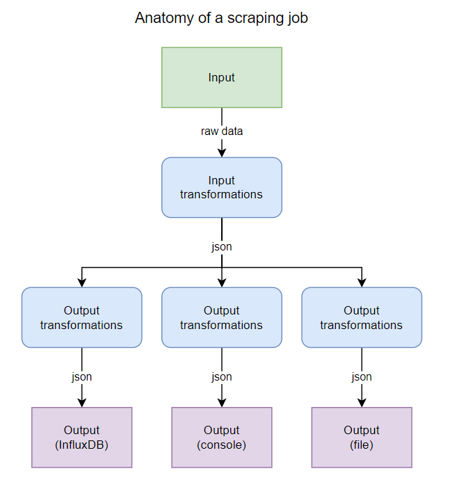

# WebDataFetcher

Simple yet flexible web data fetcher that allows you to run scaping jobs periodically to extract data from endpoints and send it to various destinations (database, file, print to console, etc.).

## Features

- Scraping jobs defined in yaml
- Reshaping fetched data with transformation pipeline
- Comprehensive logging
- Scrape not only HTML, but also CSS, JSON and plain text data

## Anatomy of a scraping job

The work of a scraping job is to fetch some data from a specified endpoint, transform it (optional) to shape it the way you need, and send it to one or more destinations (store it to a database, print it to console, etc.).

A scaping job defines:
- A `schedule` : when to run the job
- An `input` : what endpoint to scrape
- One or more `outputs` : where to send the data

It also allows to specify input and outputs transformations that allow you to reshape your data like you want before sending it to the output destinations.

## Destinations

A destination is a place where to send the data, for instance a database. The following destination types are currently available:

- `console` : Print to console
- `influxdb` : InfluxDB v2 time series database
- `victoriaMetrics` : Victoria Metrics database


To use a destination, it must first be configured:

```yaml
# myConfig.yaml

destinations:

  # Console
  myConsole: # Arbitrary destination name
    type: console

  # InfluxDB
  myInfluxdb:
    type: influxdb
    options:
      url: http://influxdb:8086
      token: <your influxdb token>
      organisation: myOrganisation
      bucket: <your destination bucket>

  # Victoria Metrics
  myVictoriaMetrics:
    type: victoriaMetrics
    options:
      url: http://victoriametrics:8428

```

Once defined, they can be used as `outputs` in the scraping jobs. Lets create a job :

```yaml
jobs:
  # Let's track the price of an SSD drive
  ssdPrice: # Arbitrary job name

    # When to run the job
    schedule:
      cron: "0 0 * * *"
    
    # What to fetch
    input:
      url: https://www.newegg.ca/samsung-970-evo-plus-1tb/p/N82E16820147743

      # Transform the data
      transformations:
        
        # Extract the price from the html content
        - name: htmlScrape
          options:
            template:
              price: .price-current # css selector

        # Print the data to console
        - name: print   # We should get : { price: "$159.89" }
        
        # Remove the $ sign
        - name: replace
          target: price # from the "price" value
          options:
            search: $
            replaceWith: ""

        # Print the data to console
        - name: print   # We should get : { price: "159.89" }
        
        # Convert the price to a number
        - name: typecast
          target: price
          options:
            targetType: number

        # Print the data to console
        - name: print   # We should get : { price: 159.89 }

    # Where to send the data
    outputs:
      # Write data to Influxdb v2
      - to: myInfluxdb  # The destination name
        options:
          # InfluxDB specific options (create a point)
          measurement: price
          tags:
            product: "SSD"
            model: "Samsung 1Tb"
          fields:
            price: ${price} # Use json path to specify the target

      # Write data to victoria metrics
      - to: myVictoriaMetrics
        options:
          metrics:
            - name: price
              labels:
                product: "SSD"
                model: "Samsung 1Tb"
              value: ${price}
```


## Transformations

Transformations allow to manipulate the data before it is sent to the output. Transformations can be applied to the input or any of the outputs. The input transformations are applied before the data is sent to the outputs whereas the output transformations are applied just before sending the data to the corresponding output destination. This gives the flexibility to specify different transformations for each output.



Refer to [transformations.ts](./src/transform/transformations.ts)

### `scrapeHtml`

This transformation extracts structured data from HTML content using CSS selectors.

```yaml
transformations:
  - name: scrapeHtml
    options:
      template:
        # Simple field extraction using CSS selectors
        title: h1
        price: .price-current
        description: p.description
        
        # Nested object extraction
        details:
          manufacturer: .manufacturer
          model: .model-number
          
        # Array extraction
        features:
          - .feature-item
```

Example:
```yaml
transformations:
  - name: scrapeHtml
    options:
      template:
        price: .price-current
        name: h1.product-title
        
# Input: HTML content of a product page
# Output: { "price": "$159.99", "name": "Samsung 970 EVO Plus 1TB SSD" }
```

### `regexReplace`

```yaml
transformations:
  - name: regexReplace

    # If the input data is in JSON, you need to specify
    # the json path of the value you want to affect
    target: <json path>
 
    options:

      # The regex pattern to match
      pattern: <regex pattern>

      # The output, where you can specify the group matches
      # in the regex pattern by using $1, $2, $3, ...
      output: <output pattern>

# Example
transformations:
  - name: regexReplace
    options:
      pattern: "(\w+) (\w+)"
      output: "Hello Mr. $2, or should I call you $1 ?"

# Input value:       "James Bond"
# Output value:      "Hello Mr. Bond, or should I call you James ?"
```

This transformation is equivalent to calling `outputValue = inputValue.replace(new RegExp(pattern), output)` in Javascript.

### `replace`

```yaml
transformations:
  - name: replace
  
    # If the input data is in JSON, you need to specify
    # the json path of the value you want to affect
    target: <json path>
    
    # The specific transformation options
    options:

      # The substring to search
      search: <search value>

      # The value to replace the substring with
      replaceWith: <replace with this value>


# Example
transformations:
  - name: replace
    options:
      search: "abc"
      replaceWith: "ABC"

# Input value:       "abcdef abcdef"
# Output value:      "ABCdef ABCdef"
```

This transformation is equivalent to calling `outputValue = inputValue.replaceAll(search, replaceWith)` in Javascript.

### `textToJson`

Converts an text input value to JSON. This is equivalent to calling `outputValue = JSON.parse(inputValue)` in Javascript.

```yaml
transformations:
  - name: textToJson
  
    # You may optionally specify a target if you want to
    # transform a nested string field into json
    target: <json path>

# Example
transformations:
  - name: textToJson

# Input value:       '{ "hello": "world" }'      (text string)
# Output value:       { "hello": "world" }       (json)
```

### `restructure`

This transformation allows you to extract data from a JSON input value and restructure it, changing field names.

```yaml
transformations:
  - name: restructure
    
    # You may optionally specify a target if you want to
    # transform a nested string field into json
    target: <json path>

    options:
      
      # The template represents the new object to create
      # by specifying the outputValue field names and the
      # json path to the value
      template:
        <field name>: <json path>

        # You can also build nested objects
        <field name>:
          <field name>: value

# Example
transformations:
  - name: restructure
    options:
      template:
        contactInfo:
          phone: $.phone
          email: $.email
        name:
          first: $.firstName
          last: $lastName


# Input value:
# {
#    "firstName": "James",
#    "lastName": "Bond",
#    "address": "123 A Street"
#    "phone": "111-111-1111"
#    "email": "james.bond@mi6.gov"
# }
#
# Output value:
# {
#     "contactInfo": {
#       "phone": "111-111-111"
#       "email": "james.bond@mi6.gov"
#     },
#     "name": {
#       "first": "James",
#       "last": "Bond"
#     }
# }
#
```


### `count`

This transformation allows you count the number of element in an array or characters of a string.

```yaml
transformations:
  - name: count
    
    # You may optionally specify a target if you want to
    # transform a nested string field into json
    target: <json path>

# Example
transformations:
  - name: count
    target: members

# Input value:
# {
#    "members": ["John", "Max", "David", "Helen", "Jo"]
# }
#
# Output value:
# {
#     "members": 5
# }
#
``````

## Other ideas of transforms

- CsvToJson : Convert the given CSV to a JSON object
- RenameField : Rename a field
- SimpleEval : Resolves a math operation on one or multiple numeric fiels (`[fieldName] + [fieldName]`)
- Scrape : Scrape the value as HTML, output the json result
- sed : Équivalent of `sed` command line tool
- Dedupe : Remove duplicate enties in an array of data if specified field values match

# TODO

- [ ] Capture exceptions during job (ex: if the website changes, some data may be null and some transform will throw exception)
- [ ] Add support for `intFields`, `booleanField` (influxdb destination) ?
- [ ] Implement json path to specify target
- [ ] Support composing new values from multiple source fields using JsonPath expresions in `restructure` transform (ex: `output: "${$.price} - ${$.model}"`)
- [ ] Use brackets with json path for `target` in transformations for more consistency ?
- [x] Add a `disable` option for destinations to disable a specific destination
- [ ] Add a `disable` option for outputs to disable a specific output (in jobs) ?
- [ ] Option to combine the result of multiple requests (and dedupe for a certain key)